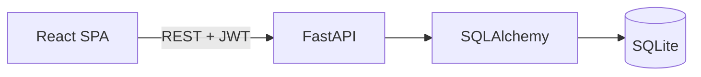

# Architecture

The SPA sends credentials to FastAPI and stores the returned short-lived access token. Protected dashboard requests include that token in the `Authorization` header. FastAPI validates requests with Pydantic, performs database queries through SQLAlchemy, and returns JSON response schemas.

The backend owns authentication, validation, user CRUD operations, KPI queries, and CSV imports. React provides the admin interface and simple client-side search and status filtering for the small assessment dataset. The production Docker image serves the compiled SPA and API from the same FastAPI server.
