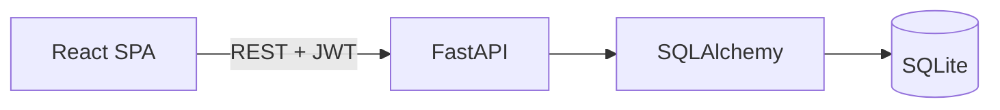

# Architecture

The SPA sends credentials to FastAPI and stores the returned short-lived access token. Protected dashboard requests include that token in the `Authorization` header. FastAPI validates requests with Pydantic, performs database queries through SQLAlchemy, and returns JSON response schemas.

Customer pagination, search, filtering, and sorting run in the database. The browser receives only the requested page.
